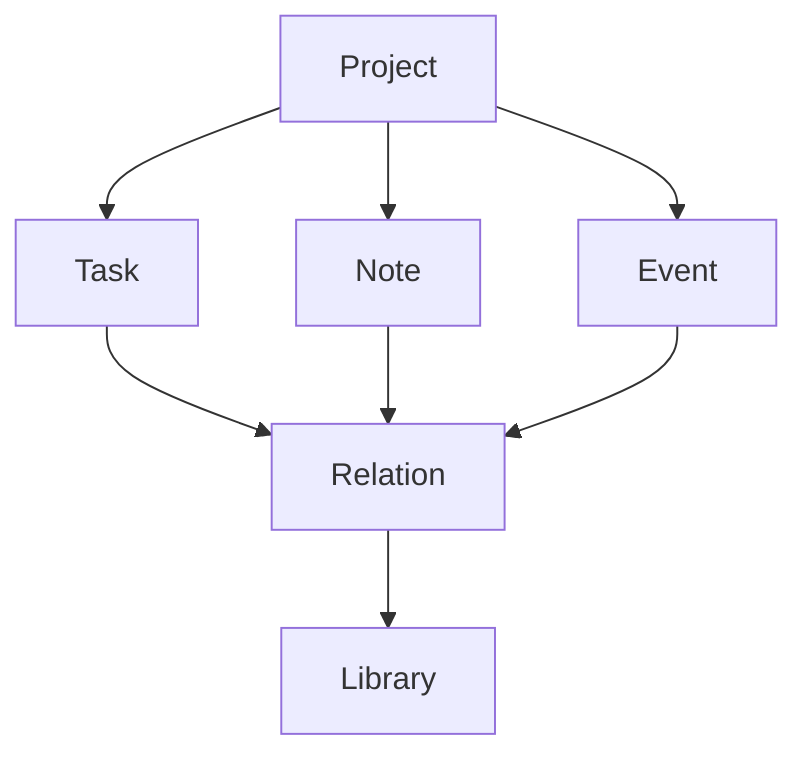

# Timora

> «나의 일상과 시간을 하나의 흐름으로.»

Timora는 할 일, 일정, 기록, 프로젝트, 자료와 개발 활동을 하나의 공간에서 연결하고 관리하기 위한 개인 Workspace 애플리케이션입니다.

우리는 하루를 보내면서 해야 할 일을 만들고, 새로운 일정을 계획하고, 생각을 기록하며, 여러 프로젝트를 진행하고, 다시 보고 싶은 자료를 저장합니다.

하지만 이러한 정보와 시간은 서로 다른 애플리케이션과 공간에 흩어지기 쉽습니다.

Timora는 흩어진 일상과 시간을 하나의 흐름으로 연결하는 것을 목표로 합니다.

Tasks, Notes, Calendar, Projects, Library가 서로 독립적으로 존재하는 것이 아니라 하나의 Workspace 안에서 서로 연결되며, 궁극적으로는 PC와 모바일, 태블릿 등 어떤 기기에서도 같은 일상과 작업의 흐름을 이어갈 수 있도록 설계합니다.

**현재 상태: Pre-v0.1 / Skeleton**

현재는 본격적인 기능 개발 이전 단계입니다. 프로젝트 구조와 PC 중심 UI Skeleton, 데이터 구조 및 향후 개발 방향을 구축하고 있습니다.

## Vision

Timora가 관리하고자 하는 것은 단순한 할 일 목록이나 일정이 아닙니다.

내가 해야 하는 것.  
내가 생각한 것.  
내가 알고 있는 것.  
내가 만들어가는 것.  
그리고 그것들을 위해 사용하는 시간.

Timora는 이 모든 것을 하나의 흐름으로 연결하는 개인 Workspace를 목표로 합니다.

---

## 나의 일상과 시간, 기록과 작업을 하나의 흐름으로

우리는 하루 동안 수많은 도구를 사용합니다. 해야 할 일은 할 일 관리 앱에 기록하고, 일정은 캘린더에 저장하며, 생각은 메모 앱에 적습니다. 개발 프로젝트는 GitHub에서 관리하고, 나중에 다시 보고 싶은 자료는 북마크에 저장합니다.

하지만 이 정보들은 대부분 서로 다른 공간에 흩어져 있습니다. Timora는 이들을 하나의 개인 Workspace 안에서 연결하는 것을 목표로 합니다.

## 프로젝트의 목표

| 내 일상의 정보 | Timora의 영역 |
| --- | --- |
| 내가 해야 하는 것 | Tasks |
| 내가 언제 해야 하는 것 | Calendar |
| 내가 생각하고 기록한 것 | Notes |
| 내가 만들고 있는 것 | Projects |
| 내가 발견하고 보관한 것 | Library |

이 모든 정보가 서로 연결되어 하나의 흐름을 만드는 것이 Timora의 핵심 목표입니다.

## 기본 구조

### Home

현재 나의 상태를 한눈에 확인하는 공간입니다. 오늘의 할 일, 예정된 일정, 진행 중인 프로젝트, 최근 작성한 노트와 Inbox 등을 보여줍니다.

### Today

오늘이라는 시간에 집중하는 공간입니다. 오늘 해야 할 일과 일정, 프로젝트 작업 등을 한곳에서 확인할 수 있습니다.

### Inbox

갑자기 떠오른 생각이나 해야 할 일을 빠르게 기록하는 공간입니다. 처음부터 정보의 종류를 결정할 필요 없이 기록한 뒤 나중에 Task, Note, Event, Project, Library 등으로 정리할 수 있도록 설계할 예정입니다.

### Tasks

해야 할 일을 관리합니다. 마감일, 우선순위, 프로젝트, 태그 등을 이용해 작업을 관리할 수 있도록 개발할 예정입니다.

### Notes

생각과 지식을 기록하는 공간입니다. Markdown을 기반으로 하며 향후 문서 간 링크와 Backlink 등을 지원하는 것을 목표로 합니다.

### Calendar

일정과 Task의 마감일을 시간의 관점에서 확인합니다. 향후 외부 Calendar 서비스와의 연동도 고려하고 있습니다.

### Projects

Timora의 핵심 영역 중 하나입니다. 하나의 프로젝트 안에서 관련된 Tasks, Notes, Calendar, Library, Files 및 GitHub 활동을 함께 관리하는 것을 목표로 합니다.

### Library

웹사이트, 문서, 영상, GitHub Repository, PDF 등 나중에 다시 확인하고 싶은 자료를 저장하는 공간입니다.

## 연결

Timora에서 정보는 서로 완전히 분리되어 있지 않습니다. 하나의 프로젝트에 Task와 Note를 연결하고, 특정 Task와 관련된 자료를 Library에서 연결하는 것처럼 각 정보를 서로 연결할 수 있는 구조를 목표로 합니다.



이를 위해 장기적으로 Object + Relation 기반 데이터 구조를 구축할 예정입니다. 모델의 초기 개념은 [docs/data-model.md](docs/data-model.md)에 있습니다.

## GitHub Integration

개발 프로젝트를 관리하기 위해 GitHub 연동을 지원할 예정입니다. 프로젝트에 GitHub Repository를 연결하면 향후 다음 정보를 Timora에서 확인할 수 있도록 개발할 계획입니다.

- Repository
- Branch
- Commit
- Issue
- Pull Request
- 최근 개발 활동

장기적으로는 Workspace Task와 GitHub Issue를 연결하는 기능도 고려하고 있습니다.

## 개발 로드맵

| 단계 | 목표 |
| --- | --- |
| 현재 — Skeleton | 향후 개발을 위한 구조, PC 중심 UI, 문서 |
| v0.1 — Core | Home / Today / Inbox / Tasks / Notes / Calendar / Projects / Library / Settings 핵심 기능 |
| v0.2 — GitHub | GitHub 계정 및 Repository 연동 시작 |
| v0.3 — Relations | Task, Note, Project, Event, Library 간 연결 |
| v0.4 — Search & Capture | Global Search, Command Palette, Quick Capture |
| v0.5 — Desktop | Windows 설치형 Desktop Application |
| v0.6 ~ v0.9 | 동기화, Offline, Backup, Security, 성능 개선, Mobile Architecture 준비 |
| v1.0 — Multi Device | Android 및 Tablet, 여러 기기에서 같은 데이터 사용 |
| v1.1+ | Home Screen Widget, Today Widget, Notifications, 모바일 Quick Capture, Widget에서 Task 완료 |

자세한 단계는 [ROADMAP.md](ROADMAP.md)에 정리합니다.

## 장기적인 방향

PC, 모바일, 태블릿에서 동기화된 Timora Core를 통해 Tasks, Notes, Projects, Calendar, Library와 GitHub를 연결하는 구조를 지향합니다.

Timora의 최종 목표는 많은 기능을 가진 생산성 앱을 만드는 것만이 아닙니다.

내가 오늘 무엇을 해야 하는지, 무엇을 생각했는지, 무엇을 만들고 있는지, 무엇을 발견했는지, 그리고 나의 시간이 어디에 사용되고 있는지를 하나의 공간에서 이어주는 것. 그것이 Timora가 지향하는 방향입니다.

## 현재 상태와 실행

🚧 **초기 개발 / Skeleton** — 실제 사용을 위한 완성 버전이 아닙니다. v0.x 개발 과정에서 구조, UI, 데이터 모델 및 API가 크게 변경될 수 있습니다.

현재는 9개 샘플 화면의 이동과 기본 반응형 레이아웃만 구현했습니다. 생성, 편집, 저장, 검색, 인증, GitHub 연결, 동기화는 동작하지 않습니다. 샘플 날짜는 고정되어 있습니다.

Node.js 20 이상에서:

```bash
npm ci
npm run dev
```

터미널에 표시된 주소를 브라우저에서 엽니다. `npm run typecheck`와 `npm run build`로 확인할 수 있습니다. 배포 환경에서 하위 경로를 직접 열려면 SPA fallback이 필요합니다.

## 프로젝트 구조

```text
src/
  app/App.tsx          공통 셸, 화면, 라우팅의 초기 구현
  data/sample.ts       고정 샘플 데이터
  domain/models.ts     UI용 객체·관계 타입 초안
  main.tsx             진입점
  styles.css           공통 스타일과 반응형 규칙
docs/
  architecture.md      Desktop / Mobile / Backend 분리 방향
  data-model.md        Object + Relation 개념
  ui-structure.md      화면과 탐색 구조
```

Vite, React, TypeScript, React Router를 사용합니다. 백엔드와 모바일 앱은 포함하지 않습니다. PC에서 본격적인 개발을 이어갈 때 [REQUIREMENTS.md](REQUIREMENTS.md), [ROADMAP.md](ROADMAP.md), [docs/architecture.md](docs/architecture.md), [docs/data-model.md](docs/data-model.md), [docs/ui-structure.md](docs/ui-structure.md)를 먼저 읽고 화면별 코드를 feature 단위로 분리하세요.

## License

라이선스는 아직 결정되지 않았습니다.
